# Foodies Fanclub

I'm a food lover, just like many of others. Food posts and new recipes have always caught my attention, inspiring me to try new dishes and explore my culinary creativity. This passion led me to create Foodies Fanclub, a platform designed for people who share the same love for food.

Foodies Fanclub is a user-friendly space where user can upload pictures of their favorite recipes and engage with others in the community. User can like and comment on recipes, building an interactive and supportive food community. Additionally, User have the option to save their cherished recipes for future reference and create ingredient lists for their next culinary adventures.

My goal is to unite food enthusiasts from all corners of the world. User will find an ever-growing collection of delicious recipes referance, cooking tips, and the collective wisdom of a community that shares the same passion for great food. Whether they are a seasoned chef, an aspiring cook, or simply someone who appreciates a good meal, Foodies Fanclub is here to make user's culinary journey more enjoyable.

This fictional site was created for Portfolio Project #5 (Advanced Front End) - Diploma in Full Stack Software Development Diploma at the [Code Institute](https://www.codeinstitute.net).

[View live website here](https://project-react-5-90ce600c5df4.herokuapp.com/)

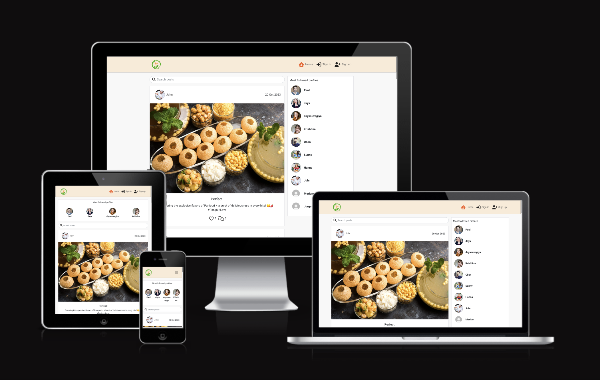

## Table of Contents

- [Project](<#project>)
    * [Objective](<#objective>)
    * [Site Users Goal](<#site-users-goal>)
    * [Project Management](<#project-management>)
        *[Github Project Board](<#github-project-board>)
        *[Database Schema](<#database-schema>)

- [User Experience (UX)](<#user-experience-ux>)
    * [Wireframes](<#wireframes>)
    * [User Stories](<#user-stories>)
    * [Site Structure](<#site-structure>)
    * [Design Choices](<#design-choices>)

- [Existing Features](#features)
    * [Navigation](#navigation)
    * [Authentication](#authentication)
    * [Homepage](#homepage)
      *[Popular Profiles Component](#popular-profiles-component)
      *[Searchbar](#searchbar)
    * [Feed](#feed)
    * [Add New Meal](#add-new-meal)
    * [Ingredients](#ingredients)
    * [Recipes](#recipes)
    * [Profile Page](#profile-page)
    * [Like](#like)
    * [Comments](#comments)
    * [Page Not Found](#page-not-found)
    * [Notification](#notification)
    * [Reusable React Components](#reusable-react-components)

- [Future features](#future-features)
- [Components](#components)
- [Hooks](#hooks)

- [Technology](#technology)
    *[Languages](#languages)
    *[Frameworks and Software](#frameworks-and-software)
    *[Libraries](#libraries)

- [Testing](#testing)
    *[Automated tests](#automated-tests)
    *[Manual testing](#manual-testing)

- [Deployment](#deployment)
    *[Deployment to Heroku](#deployment-to-heroku)

- [Bugs](#bugs)
- [Credits](#credits)
- [Acknowledgements](#acknowledgements)
    

    # **Project**

    ## Objective

    Foodies Fanclub aims to create a vibrant online community where food enthusiasts can connect, share their favorite recipes pictures, and discover new culinary experiences. The platform allows users to view, create, edit, delete, comment and review Food posts. The content can be viewed in a logical order and searched on by keywords. Users can also follow each other.

    ## Site User's Goal

    The goal of Foodies Fanclub is to become the go-to online destination for food lovers worldwide, providing a welcoming space for sharing, discovering, and celebrating the world of food. I aim to build a thriving and engaged community of users who connect over their shared passion for food, creating a repository of diverse, mouthwatering recipes and culinary wisdom. Our ultimate goal is to inspire, and delight food enthusiasts of all levels, fostering a global network of individuals who are united by their love for great food and the joy it brings to our lives.

    ## Project Management

    ### Github Project Board

    I've been using the project board in GitHub to keep my project together. In the initial design phase, it was really helpful to plan the project as a whole, and create the user stories based on my wireframe designs. I created a Milestone for each main app created in the backend API plus one additional for Navigation and Authentication, in order to maintain a similar structure to the backend [Project Board](https://github.com/users/Dayasuvagiya/projects/7). Each milestone has a list of bullet points for the main desired frontend features.

    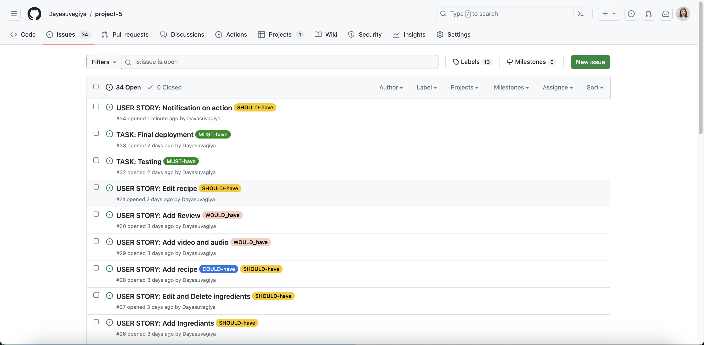
    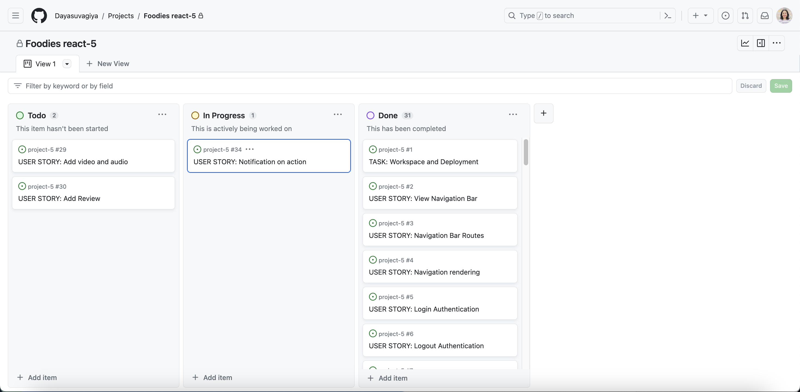

    ### Database Schema

    All the models have been set up in a separate DRF repository. Click [here](https://github.com/Dayasuvagiya/react.api) to view the repository or [here](https://react-api-p5-3222a1d91d69.herokuapp.com/) to view the deployed API.

    # **User Experience (UX)**

    ## Wireframes

    The wireframes for the site were created in the software [Balsamiq](https://balsamiq.com). The wireframes have been created principally for desktop devices as this is a browser based platform. However, the wesbite is responsive for tablet and mobile. The main grid layout of the components is initially based on the CI Moments walkthrough tutorial as this seems to me the best layout both for wider desktops as for smaller mobile devices for a content sharing platform so I didn't see much reason to change it or find many areas where I could improve on it. Any differences are down to personalised content that fits the project goals.

    

<b>Wireframes</b>

    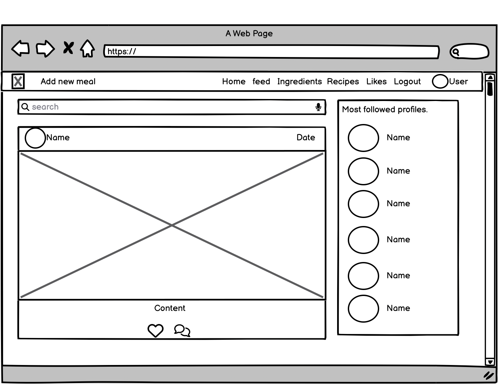
    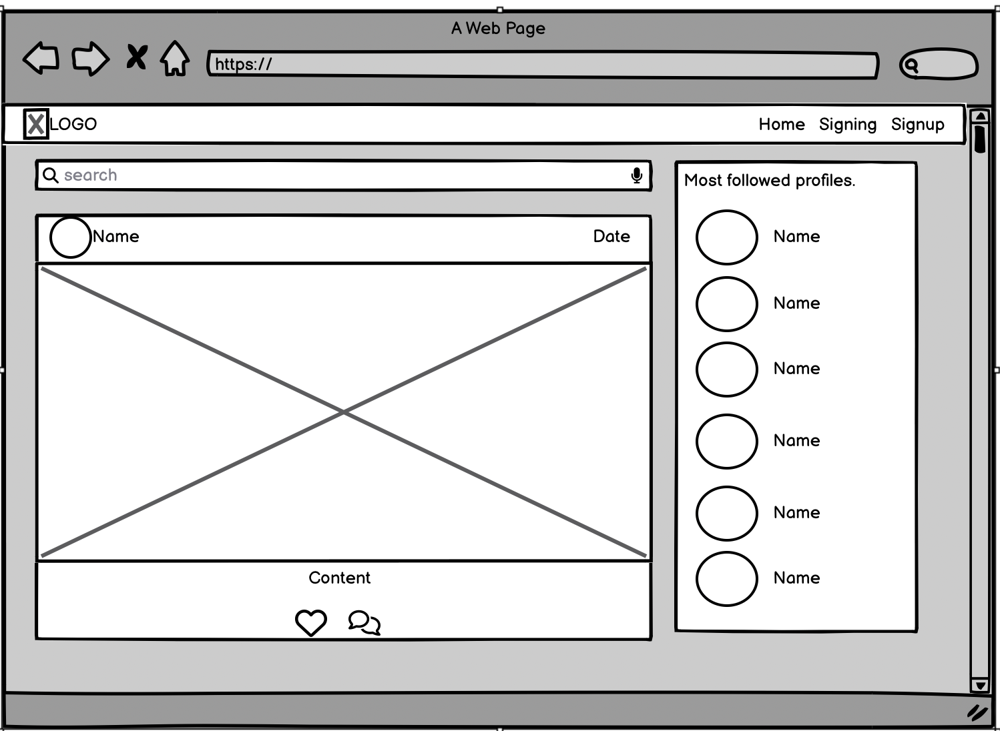
    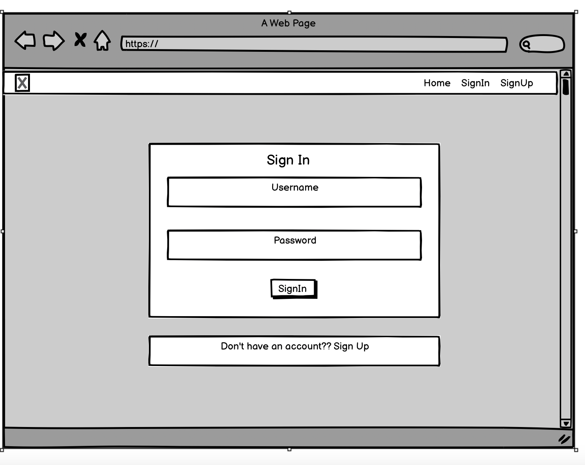
    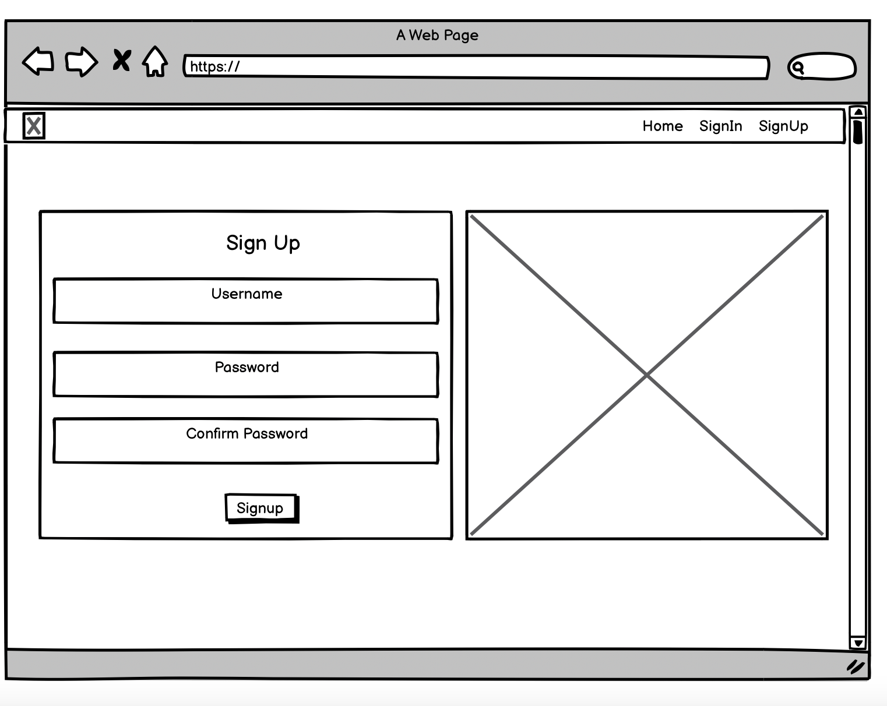
    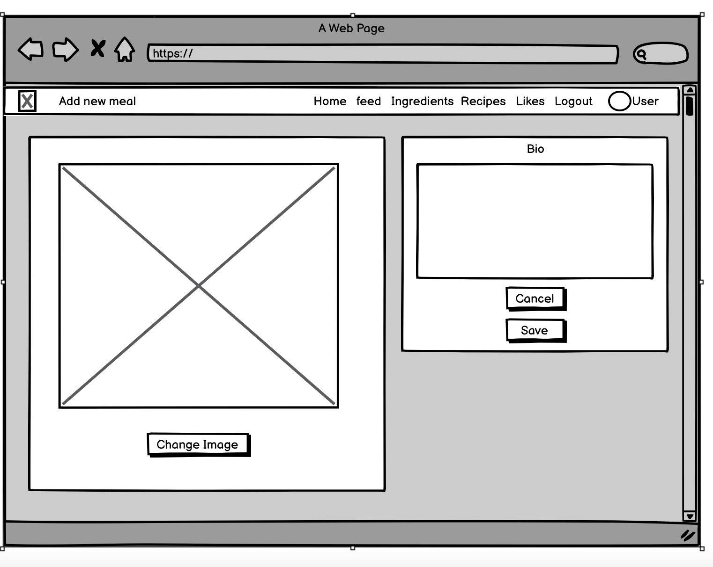
    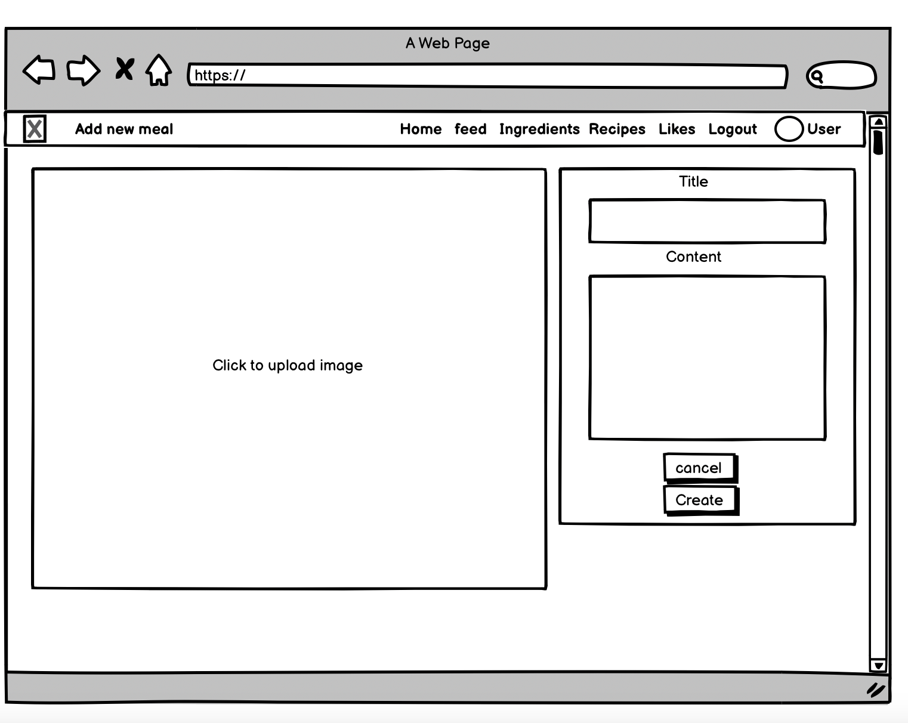
    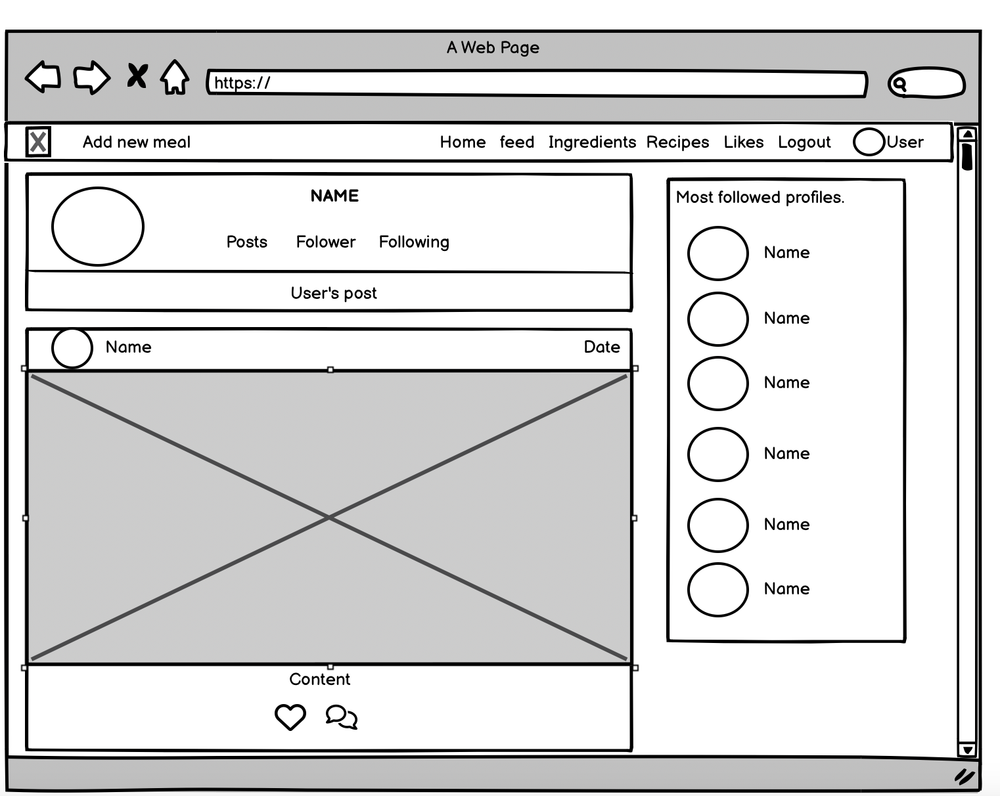
    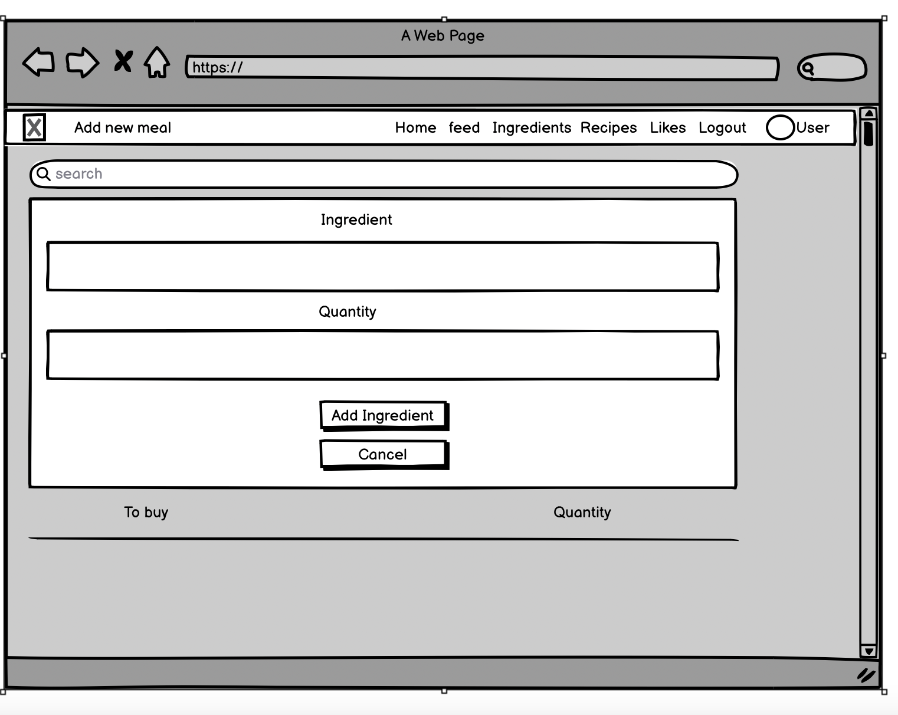
    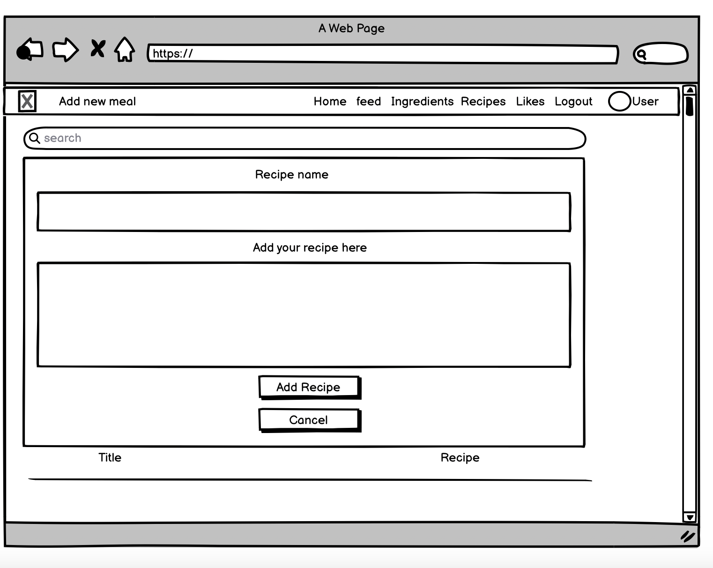

    
 

    ## User Stories
Here I have listed the main user stories for a user who is not logged in, or has no account and a logged in user. These user stories were then tested and confirmed in the [Testing](<#testing>) section.

### Logged Out Site User
|  | | |
|:-------:|:--------|:--------|
| As a Logged out User | I can log in so that I can interact fully with the site | &check; |
| As a Logged out User | I can sign up so that I can interact fully with the site | &check; |
| As a Logged out User | I can see a list of all posts so that I can see all Posts that have been shared to the site | &check; |
| As a Logged out User | I can view the popular profiles so that I can see who has the most followers | &check; |
| As a Logged out User | I can view the details of an individual profile page so that I can see more profile data | &check; |
| As a Logged out User | I can filter posts so that I can view only the post I'm interested in | &check; |
| As a Logged out User | I can search post by title, profile, date or tag so that I can find one particular post | &check; |
| As a Logged out User | I can view comments of a post so that I can see what other users think about the foos post | &check; |

### Logged In Site User
|  | | |
|:-------:|:--------|:--------|
| As a Logged in User | I can log in so that I can interact fully with the site | &check; |
| As a Logged in User | I can log out from the site so that no-one else can interact with the site using my details | &check; |
FOOD-POSTS
| As a Logged in User | I can see a list of all posts so that I can see all posts that have been shared to the site | &check;
| As a Logged in User | I can view a single post so that I can see single post details | &check; |
| As a Logged in User | I can view the feed page so that I can only see posts of profiles I follow | &check; |
| As a Logged in User | I can view the details of an individual profile page so that I can see more profile data | &check; |
| As a Logged in User | I can see all the posts from one profile so that I can view all the posts of one profile easily | &check; |
| As a Logged in User | I can filter posts by category so that I can view only the post I'm interested in  | &check; |
| As a Logged in User | I can search posts by title, profile, date or tag so that I can find one particular post | &check; |
| As a Logged in User | I can create a new post so that I can promote my didh picture| &check; |
| As a Logged in User | I can edit my posts so that I can change the details or correct mistakes | &check; |
| As a Logged in User | I can delete my own posts so that I can remove posts from the site | &check; |
COMMENTS
| As a Logged in User | I can view comments of the food post so that I can see what other users think about the dish | &check; |
| As a Logged in User | I can create a comment so that I can publicly show my thoughts about my delicious dish | &check; |
| As a Logged in User | I can edit my comments so that I can correct mistakes | &check; |
| As a Logged in User | I can delete a comment that I created so that I can remove comments as I see fit | &check; |
FOLLOW
| As a Logged in User | I can follow another user so that I can see their posts in my feed page | &check; |
| As a Logged in User | I can unfollow another user so that I can stop seeing their food post in my feed page | &check; |
INGREDIENT
| As a Logged in User | I can add ingredients so that I can have a list of ingredient for shopping or next recipe| &check; |
| As a Logged in User | I can Edit and delete ingredients from ingredient list so that I can change my shopping list | &check; |
RECIPE
| As a Logged in User | I can add recipe so that I can keep record of recipes for future reference| &check; |
| As a Logged in User | I can Edit and Delete Recipe from list so that I can change my recipe base on test | &check; |
PROFILES
| As a Logged in User | I can view the popular profiles so that I can see who has the most followers | &check; |
| As a Logged in User | I can view the profile page of another user so that I can see more details about that user | &check; |
| As a Logged in User | I can edit my own profile page so that I can add additional information for other users to see about me | &check; |
| As a Logged in User | I can change my username and password so that I can change my login details if I feel they are not secure | &check; |
| As a Logged in User | I can change my username and password so that I can change my login details if I feel they are not secure | &check; |

[Back to top](<#table-of-contents>)

## Site Structure

Foodies Fanclub is split up in two parts: when the user is logged out and when the user is logged in. Depending on login status different pages are available for the user. When the user is logged out the pages: Home, and Sign In or Up are available from the Navigation Bar menu. When the user is logged in Feed, Add a meal, feed, ingredients, recipes, like, Signout and Profile Page also become available. 

## Design Choices

* ### Color Scheme

Color scheme reflects the warm and inviting world of culinary delights. Antique white serves as the navbar, providing a clean and timeless canvas for our content. Orange accents infuse a vibrant and appetizing energy into the design, symbolizing the zest and creativity of the food community. Together, these colors create a harmonious and enticing visual environment that complements our culinary journey."

* ### Typography
- 'Playfair Display', serif: This elegant and timeless serif font brings a touch of classic refinement to our platform. It is used for headings, titles, and other prominent text elements, adding an air of distinction to our content.

- 'Roboto', sans-serif: The 'Roboto' sans-serif font provides a modern, clean, and legible typeface for the body text and other essential content. It ensures readability and a seamless reading experience across all devices.

# **Existing Features**

## Navigation

The navigation bar is very clean and straight forward. Depending on whether you are logged in or not, different menus are visible for the site user. For tablet and mobile devices, the navigation bar menu turns into a hamburger dropdown list. 

On accessing the site for the first time, the user is logged out and the following menu items are visible:

* Foodies Fanclub Logo - On the far left hand side of the navigatin bar is the Foodies Fanclub brand logo. This is visible throughout the site to all user types and contains a link back to the homepage. 
* Home - the first menu item, and the initial default start page, is 'Home', where all posts shared among the community are displayed. 
* Authentication - Next to the Home user has the options to Signin or Signup which takes them to the respective page. 

Once the user logs in, additional links become available to select:

* Add new meal - Logged in users can access the add new meal where they can create a food posts.
* Feed - Logged in users can access the feed page where they can see posts of other profiles they follow.
* Ingredients - Logged in users can go to the ingredient page and make ingredient list.
* Recipes - Logged in users can go to the recipes page and add receipe to keep record.
* Like - Logged in users can see all liked posts. 
* Authentication - The icons within the authentication change once a user has logged in, and now display a link to the user's own profile page or a link to sign out of the site. 

## Authentication

Users who are new to the site, or haven't previously created an account can click on the Signup Menu option on the Navigation Bar to create a user account.  I have used the standard dj-rest/auth/registration user account signup process for this. 

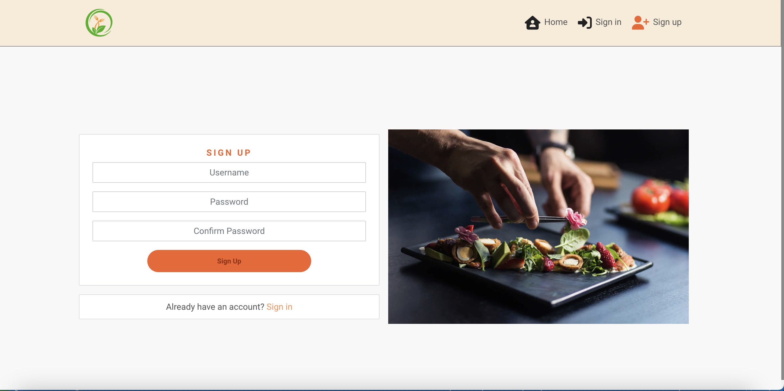

If a user has a Foodies Fanclub user account, they can click on the Signin menu option in the Navigation Bar to sign into their account.

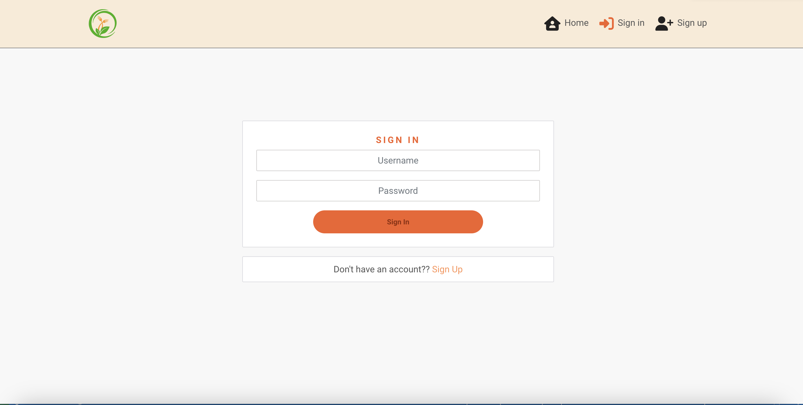

## Homepage

The Home Page serves as the central hub of our culinary platform. It offers users the following key features:

Post Exploration: Users can discover an array of culinary posts from contributors worldwide. Whether it's a tantalizing dish, a cherished recipe, or a culinary story, this page provides a space for inspiration and exploration.

Interactive Engagement: Users have the ability to engage with posts by liking and leaving comments. This interaction fosters a lively culinary community where users can share their thoughts, tips, and compliments.

User Connections: Profile owners can establish connections by following other users. This enables them to receive updates on the culinary journeys of those they follow. Users can easily unfollow others should their interests change.

### Popular Profiles Component

The "Popular Profiles" feature is a consistent element present on every page of the website, situated at the top. This component employs a filter to arrange all site users based on their follower counts, with the users having the most followers considered the most popular. The top six users, with the highest follower counts, are then showcased within the "Popular Profiles" component.

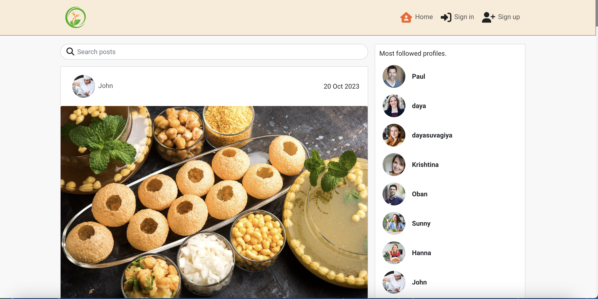

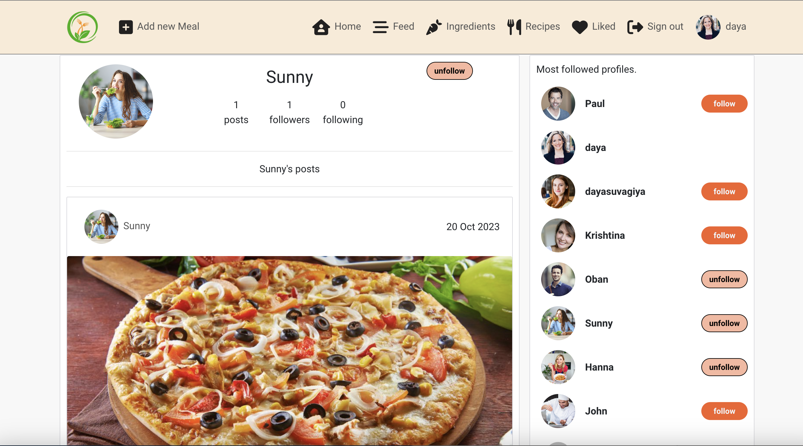

Each profile avatar can be clicked on to view the full profile page of that user. 

### Searchbar
The entry feed, My plants, To-do list, Shoppinglist, Following and Liked entries feature a searchbar for easy navigation. If no match to searchquery can be found a No results image and message is displayed. 

## Feed
Users food posts are displayed in the post feed on the home page, sorted by latest posts by all users. The feed features infinite scrolling, as long as there is content the user can scroll further. 

Clicking on the comments icon will redirect the user to a detailed view of the post and it's commentfield. 

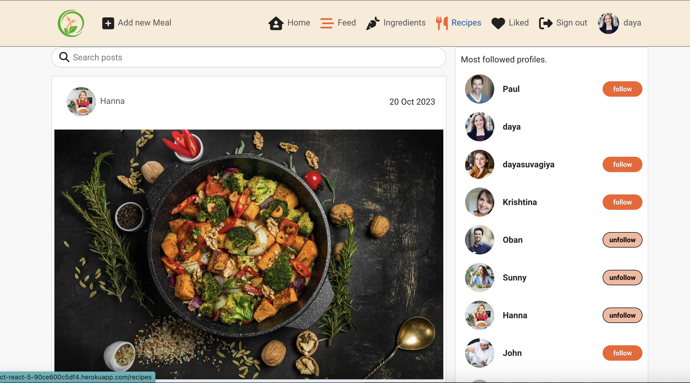

## Add New Meal

Our "Add new Meal" page provides you with an empty canvas to share culinary adventures with the world. It's a space where user can create and post a new culinary masterpiece, complete with an image, title, and delightful story.

Image: Add a mouthwatering image of the dish, allowing others to see the visual appeal of the creation.

Title: Give a captivating title that sets the stage for what's to come. Make it as tempting as the dish!

Content: Share the magic behind the creation. Tell the story of the meal, its ingredients, preparation, and what makes it special. User content can be as simple or as detailed as they like.

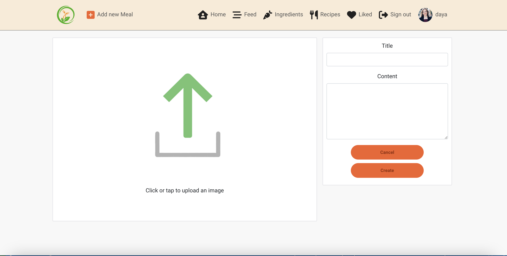

## Ingredients

Our Ingredient page is a versatile tool designed to make user's culinary journey more organized and efficient. Here's what user can do:

Add Ingredients: Need to create a shopping list for user's next culinary adventure? Or perhaps they want to keep track of those essential ingredients for their upcoming recipes? user can easily add ingredients to the list with a simple click with name of the ingredient and how much quantity they want.

Edit and Customize: Ingredients can be edited and customized to fit specific needs. Update quantities, notes for different recipes.

Delete and Organize: If user have used up an ingredient or no longer need it on the list, user can effortlessly delete it. Keep an ingredient list clean and organized at all times.

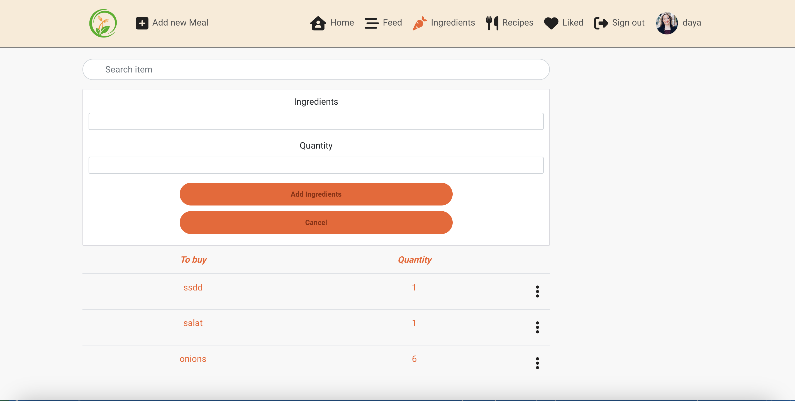

## Recipes

When navigate to the Recipe Page, user will find a space dedicated to preserving food recipe for future enjoyment:

Add Recipes: Capture the essence of culinary creations by adding the recipe name and its full details. This allows user to create a comprehensive culinary journal, making it easy to revisit favorite dishes anytime.

Edit and Customize: Recipes aren't set in stone, and  culinary skills may evolve. User can edit recipe names and content to reflect any changes or improvements.

Delete and Organize: If a recipe no longer suits taste or needs, User have the option to delete it. 

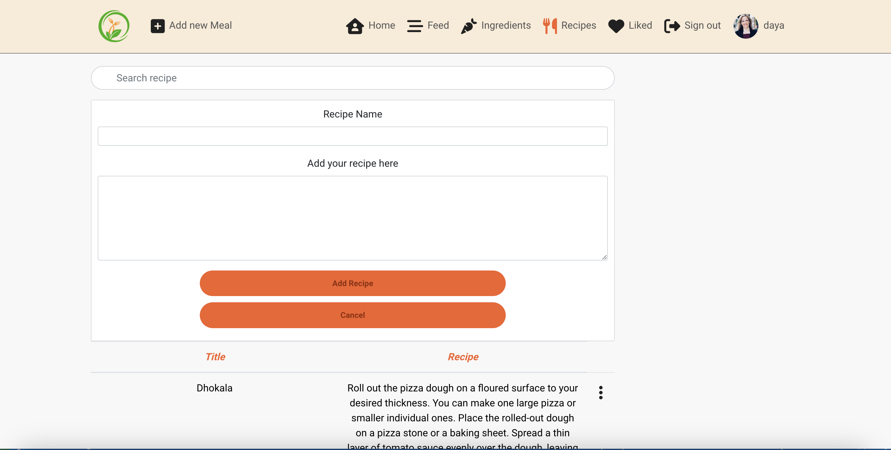

## Profile Page

Clicking the avatar image or username in the navbar redirects the user to their own profile page. Here they can view all their own food posts, add a bio and profile image, see how many posts they've made, how many other users they are following and how many are following them. Clicking the dropdown menu lets the user edit their username, password and bio. 

If a user tries to edit their username to an already existing one they will be notified of this. If they try to change their password to an invalid one they will be notified of this.

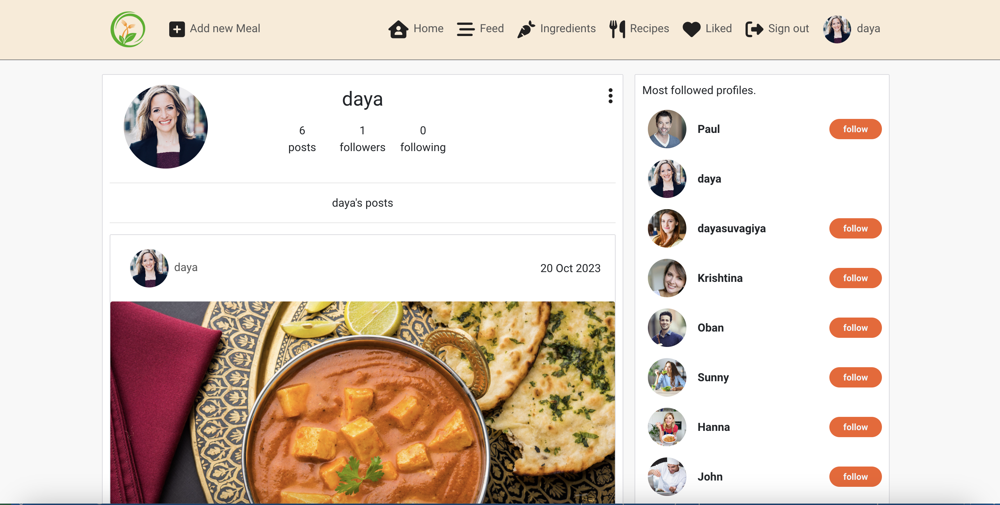

## Like
By clicking the heart icon on a diary post a user can like the post, increasing the likes count on a post. The post is also saved to the Liked entries feed, so that users can find and read their favorite entries again. 
By clicking the heart icon again the likes count is decreased and the post is  removed from the Liked entries feed. 

User can not like their own post, and are notified if they try to click the heart icon on their own post.

## Comments
Users can comment on posts through the commentfield. When posting a comment the comments count on the post is increased, and decreased if a user deletes their comment.

Only the user who posted the comment can edit or delete it.

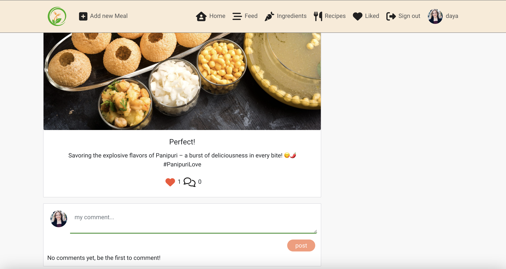

## Page not found
If the user tries a url that dont exist on Foodies Fanclub, they are redirected to a `Page not found`, which let them redirect back to the home page. 

## Notification

Foodies Fanclub platform provides users with real-time notifications to keep them informed about the success of various actions. Users will receive notifications for key events, such as successful login and logout, signing up, editing and deleting content, as well as creating new posts. These notifications ensure that users are always aware of the outcome of their actions, enhancing the overall user experience and keeping them informed about their interactions on the platform.

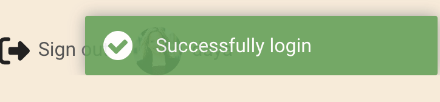
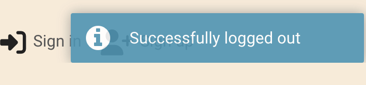

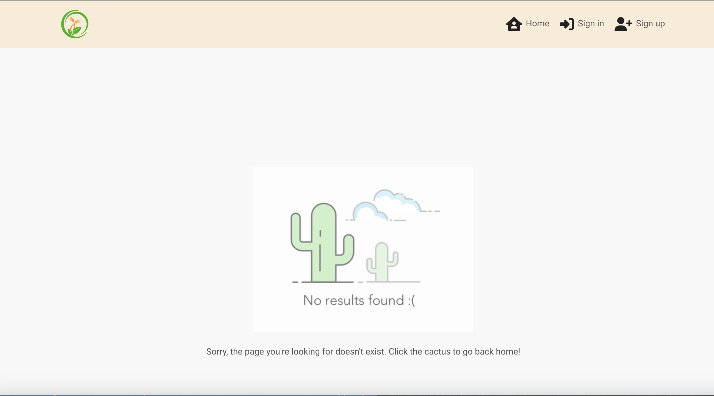

* ## Reusable React Components

### Three Dots Edit Delete Dropdown Menu

Based on the Moments walkthrough project 'MoreDropdown' component, I have utilised the same idea in my project but extended it's use even further to be accessed when editing or deleting posts, comments and also reviews. In addition to this re-usable component which I learnt from the course tutorials, I also developed four more custom re-usable components specifically for my project.

### Delete Confirmation Component

In order to improve defensive design, I wanted to add a validation check before data gets deleted from the site. For this reason, I have developed a modal pop-up component which double checks whether the user wants to continue with their choice, after having clicked the delete button from the EditDeleteDropdown component on a post, a comment or a review. This component checks what type of data the user is trying to delete, and customises the modal message appropriately. On clicking the 'Confirm Deletion' button the corresponding handleDelete function is called, and the data is removed from the site

[Back to top](<#table-of-contents>)

## Future features
 
1. Recipe Ratings and Reviews: Allow users to rate and review recipes, creating a trusted source of feedback for the community.

2. Advanced Search and Filtering: Implement a robust search and filtering system to help users find recipes, posts, and users more effectively.

3. Personalized Recipe Recommendations: Utilize machine learning to provide users with personalized recipe recommendations based on their preferences and previous interactions.

4. Video Recipe Uploads: Enable users to upload video recipes alongside traditional text and image-based recipes.

5. Food Blog Integration: Integrate a blogging feature for users who want to share more in-depth culinary experiences and insights.

[Back to top](<#table-of-contents>)

## Components
Foodies Fanclub contains unique components that can be used throughout the project.
- Asset: render a loading spinner, an image, and/or a message, set by the props. 
- Avatar: displays the users profile image.
- MoreDropDown: displays a dropdown menu for edit, delete and task done functions.
- NavBar: displays the navbar at the top of the site, with navlinks displaying dynamically depending on user authorization.
- NotFound: utilizes the Asset component and displays a message for the user if they navigate to a non existing url.

## Hooks
Aside from the hooks included in the React library, contain two unique hooks that can be used throughout the project.
- useClickOutsideToggle: provides a convenient way to handle the closing of for example a menu by monitoring clicks outside the component.
- useRedirect: redirects the user depending on user authorization status.

[Back to top](<#table-of-contents>)

# Technology

## Languages

* [HTML5](https://en.wikipedia.org/wiki/HTML) - Provides the content and structure for the website.
* [CSS3](https://en.wikipedia.org/wiki/CSS) - Provides the styling for the website.
* [JavaScript](https://en.wikipedia.org/wiki/JavaScript) - Provides interactive elements of the website
* [React.js](https://en.wikipedia.org/wiki/React_(software)) - Provides the base for the frontend components

## Frameworks and Software
* [React Bootstrap](https://react-bootstrap.github.io/) - A CSS framework that helps build solid, responsive, mobile-first sites
* [Balsamiq](https://balsamiq.com/) - Used to create the wireframes
* [Github](https://github.com/) - Used to host the repository, store the commit history and manage the project board containing user stories and bug reports.
* [Heroku](https://en.wikipedia.org/wiki/Heroku) - A cloud platform that the application is deployed to.
* [Lighthouse](https://developer.chrome.com/docs/lighthouse/overview/) - Used to test site performance.
* [Responsive Design Checker](https://www.responsivedesignchecker.com/) - Used for responsiveness check across devices.
* [Favicon](https://favicon.io/) - Used to create the favicon.
* [Google Chrome DevTools](https://developer.chrome.com/docs/devtools/) - Used to debug and test responsiveness.
* [Cloudinary](https://cloudinary.com/) - A service that hosts image files in the project.
* [My Free Logo Maker](https://myfreelogomaker.com/explore) - Used to create the Happening brand logo
* [HTML Validation](https://validator.w3.org/) - Used to validate HTML code
* [CSS Validation](https://jigsaw.w3.org/css-validator/) - Used to validate CSS code
* [JSHint Validation](https://jshint.com/) - Used to validate JavaScript code

## Libraries

* [NPM React-star-rating](https://www.npmjs.com/package/react-simple-star-rating) - A simple react component for adding a star rating to your project.

[Back to top](<#table-of-contents>)

# Testing

## Automated tests
For this project I decided to focus on writing some automated tests for the components Avatar, NavBar, NotFound.

Tests are written using React testing library MSW. All tests can be found **[here](src/components/__tests__)**. Mock handlers and server setup can be found **[here](src/mocks/handlers.js)** and **[here](src/setupTests.js)**.

## Manual testing
Foodies Fanclub have been continualy tested manually troughout development and after deployment. A full summary of manual testing can be found [here](TESTING.md).

[Back to top](<#table-of-contents>)

# Deployment

### Deployment to Heroku

Once you have created a new gitpod workspace and set up the new project, you are ready to deploy to Heroku. 

1. In your heroku account, select Create New App, and give it a unique name related to your project. 
2. Select a region corresponding to where you live and click 'Create App'.
3. Head into the 'Deploy' tab select GitHub as the 'deployment method', find your project repository and click 'Connect'.
4. Click 'Deploy branch' to trigger Heroku to start building the application. 
5. Once you see the message saying 'build succeeded' you can click 'Open App' to see your application in the browser. 

### Connect React Frontend to the API backend

Once you have set up the workspace and done a basic deploy to Heroku, you can connect the react workspace to your API, in order to send data to the API

1. In the Heroku dashboard, go into the API application settings
2. In 'Settings' add a new Config Var called 'CLIENT_ORIGIN' and set that to the URL for your deployed React application. In my case, this would be [https://project-react-5-90ce600c5df4.herokuapp.com/](https://happening-react.herokuapp.com).
3. Then add another Config Var called 'CLIENT_ORIGIN_DEV' and enter the URL of your Gitpod preview link, remembering to remove the trailing slash at the end. Gitpod occasionally changes this URL so keep an eye on it, as you are working on your project. 
4. Go back into your frontend Gitpod workspace, and install the Axios library using the command 'npm install axios'.
5. Create a folder called 'API' and inside it create a file called 'axiosDefaults'.
6. import axios at the top of the file
7. Define your baseURL which is the unique URL of your deployed API project. In my case this would be [https://react-api-p5-3222a1d91d69.herokuapp.com/]
8. Set the content-type header to multi-part/form-data as the API will need to deal with images as well as text in it's requests.
9. In order to avoid any CORS issues, set withCredentials to True.
10. Import this file into App.js to be used across all pages

## Create a react project and app
- When opening the workspace the template will setup necessary files to run React. 
- Type `npm install` and `npm start` to start the React app. 
- Create a Procfile in the root directory and add `web: serve -s build`.   
- Folders for components, hooks, pages, contexts, css etc is created in the src directory.

### Clone this Project Repository

A Git clone creates a linked copy of the project that will continue to synchronize with the original repository. In order to create a clone, you can click on the 'Code' button inside the selected repository and then select the 'Clone' option from the dropdown list.

[Back to top](<#table-of-contents>)

# Bugs
Fixed bugs
- Avatar image not displaying properly, broken image until user uploads their own: fixed by updating the file path in model. 
- ingredient page not fatch existing ingredient to edit or delete: Update serializer in api.
- Connecting backend to my frontend: By adding url in allow host and config var

[Back to top](<#table-of-contents>)

# Credits
- [CI Moments](https://github.com/Code-Institute-Solutions/moments)
- [Heroku](https://heroku.com/)
- [Font awesome](https://fontawesome.com/)
- [React bootstrap](https://react-bootstrap-v4.netlify.app/)
- [Stack Overflow](https://stackoverflow.com/)
- [W3Schools](https://www.w3schools.com/)
- [Cloudinary](https://cloudinary.com/)
- [Lucidchart](https://www.lucidchart.com/)
- [Google fonts](https://fonts.google.com/)
- [React documentation](https://react.dev/)
- [Get bootstrap](https://getbootstrap.com/)
- [Pexels](https://www.pexels.com/)
- [PNGEgg](https://www.pngegg.com/en/png-zfjmh)
- [Favicon generator](https://www.favicon-generator.org/)
- [Balsamiq](https://balsamiq.com/)

# Acknowledgements

This fictional site was created for Portfolio Project #5 (Advanced Front End Specialisation) - Diploma in Full Stack Software Development at the [Code Institute](https://www.codeinstitute.net). I would like to thank you Sarah a tutor for her support and feedback during the project. I would also like to thank everyone in my Slack class for their support, and on all the slack channels for answering my questions and concerns during this project and throughout the course. 
- Code institute for excellent teaching
- Friends and family for manual testing and input

*Daya Suvagiya, October 2023*

[Back to top](<#table-of-contents>)