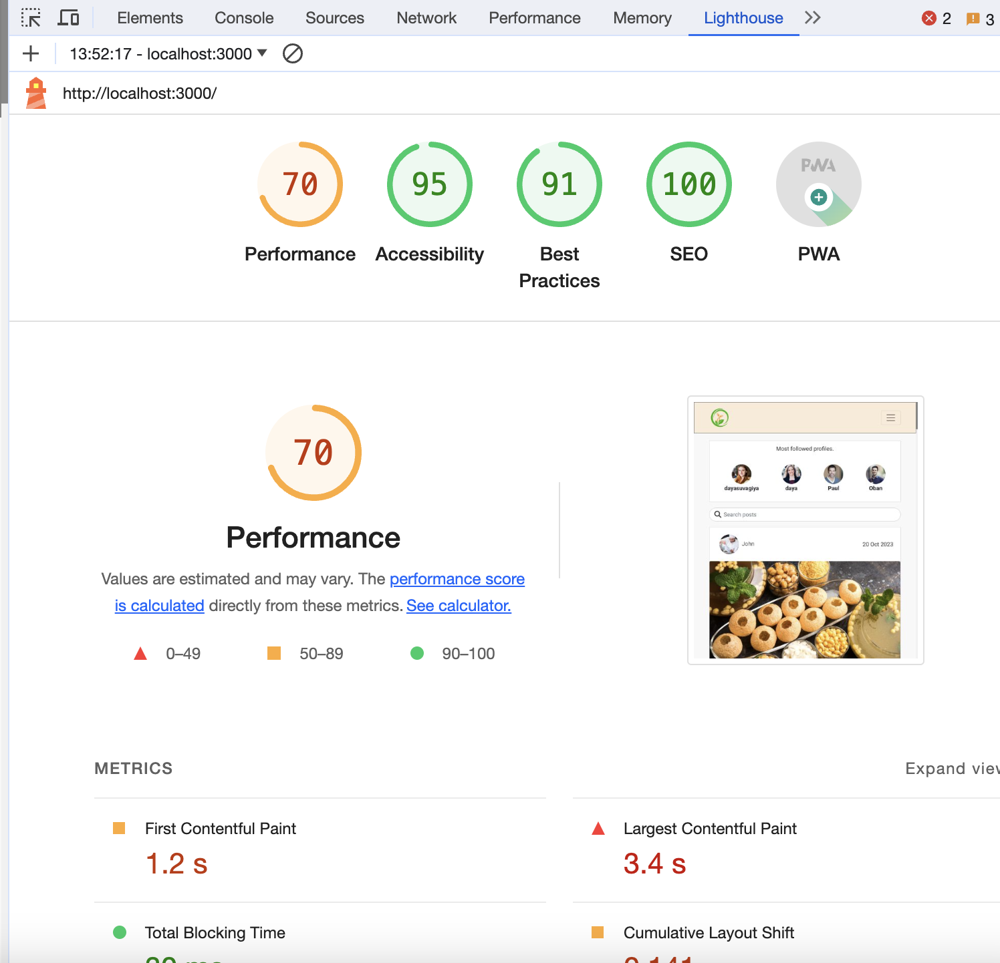

Back to [README](README.md)

# Manual testing
**Following tests have been done manually and passed.**

## Code Validation 

The Happening site has been passed through the [W3C html Validator](https://validator.w3.org/), the [W3C CSS Validator](https://jigsaw.w3.org/css-validator/) and the [ESLint Validator](https://eslint.org/docs/latest/use/getting-started#next-steps).

## Automatic Testing

The following Jest automatic tests have been written to check that the main frontend components render correctly:

### NavBar.js
|  | | |
|:-------:|:--------|:--------|
| Renders Navbar Home link| &check; |
| Renders link to the feed page for a logged in user | &check; |
| Renders link to the reviews page for a logged in user | &check; |

### NotFound.js
|  | | |
|:-------:|:--------|:--------|
| Go Back to homepage link renders | &check; |

### Avatar.js
|  | | |
|:-------:|:--------|:--------|
| Avatar renders | &check; |

## Manual Testing

As well as the automatic tests, I carried out the following additional manual tests to check all the user story scenarios:

| Status | **Authentication - User Logged Out**
|:-------:|:--------|
| &check; | Typing 'https://project-react-5-90ce600c5df4.herokuapp.com/feed' url into the browser, the user can not access the feed page. User is redirected Home
| &check; | Typing 'https://project-react-5-90ce600c5df4.herokuapp.com/interested' url into the browser, the user views the homepage posts feed
| &check; | Typing 'https://project-react-5-90ce600c5df4.herokuapp.com/ingredients' url into the browser, the user is redirected back to the homepage
| &check; | Typing 'https://project-react-5-90ce600c5df4.herokuapp.com/posts/create' url into the browser, the user is redirected back to the homepage
| &check; | Typing 'https://project-react-5-90ce600c5df4.herokuapp.com/profiles/{id}/edit' url into the browser, the user is redirected back to the homepage
| &check; | Typing 'https://project-react-5-90ce600c5df4.herokuapp.com/posts/{id}/edit' url into the browser, the user is redirected back to the homepage
| &check; | Desktop and tablet users can see an image next to the sign in form
| &check; | Mobile users can't see an image next to the sign in form
| &check; | Desktop and tablet users can see an image next to the sign up form
| &check; | Mobile users can't see an image next to the sign up form

| Status | **Navigation - User Logged Out**
|:-------:|:--------|
| &check; | Clicking the navbar brand logo loads the home page
| &check; | Clicking the Home button on the nav bar re-loads the home page
| &check; | Clicking the Sign In button on the nav bar loads the sign up page
| &check; | Clicking the Sign Up button on the nav bar loads the sign in page
| &check; | The user can not see the profile page link in the navigation bar profile section
| &check; | The user can not see the sign out link in the navigation bar profile section
| &check; | Users can not see the Feed menu option in the navigation bar
| &check; | Users can not see the Add new meal menu option in the navigation bar
| &check; | Users can not see the ingredients menu option in the navigation bar
| &check; | Users can not see the 'Add new meal' button in the navigation bar
| &check; | Tablet and mobile users can see the navigation bar options in a burger menu dropdown
| &check; | Clicking a link from the navigation bar links automatically closes the burger menu
| &check; | User can not sign in with false credentials - warning message displayed
| &check; | User can not sign in without filling out all the input fields - warning message displayed
| &check; | User can not sign up without filling out all the input fields - warning message displayed
| &check; | User can not sign up if the two password fields don't match - warning message displayed
| &check; | User can not sign up if the username chosen already exists in the database - warning message displayed
| &check; | User can sign in with right credentials - success message displayed
| &check; | User can sign up with right credentials - success message displayed

| Status | **Homepage - User Logged Out**
|:-------:|:--------|
| &check; | Users can view the Popular Profiles component
| &check; | Users can not view the follow button under each Popular Profile
| &check; | Clicking on a popular profile avatar, users are redirected to the selected profile page
| &check; | Users can view all posts - title, description, post date, image and tags
| &check; | Users can view the like count
| &check; | Users can view the follow count
| &check; | Users can view the comments count
| &check; | Clicking on an post owner avatar, users are redirected to the selected profile page
| &check; | Users can search for a particular post by typing in the title, the username of the owner, the post date.

| Status | **Posts Detail Page - User Logged Out**
|:-------:|:--------|
| &check; | Users can view the Popular Profiles component
| &check; | Clicking on a popular profile avatar, users are redirected to the selected profile page
| &check; | Users can view details of a single post
| &check; | Clicking on an post's owner avatar, users are redirected to the selected profile page
| &check; | Users can view any published comments posted about this post
| &check; | Users can not see the create comment form

| Status | **Profile Page - User Logged Out**
|:-------:|:--------|
| &check; | Users can view the Popular Profiles component
| &check; | Clicking on a popular profile avatar, users are redirected to the selected profile page
| &check; | Users can view the number of posts the profile owner has posted
| &check; | Users can view the number of followers the selected profile has
| &check; | Users can view the number of other profiles the selected profile is following
| &check; | Users can view the posts which were posted by the selected profile
| &check; | Clicking on the food image, users are redirected to the selected post detail page

| Status | **Navigation - User Logged In**
|:-------:|:--------|
| &check; | Clicking the navbar brand logo loads the home page
| &check; | Clicking the Home button on the nav bar re-loads the home page
| &check; | User can't see the sign in button in the navigation bar
| &check; | User can't see the sign up button in the navigation bar
| &check; | The user can see the sign out link in the navigation bar 
| &check; | Users can see the Feed menu option in the navigation bar
| &check; | Users can see the ingredients page in the navigation bar
| &check; | Users can see the recipes page in the navigation bar
| &check; | Users can see the like page in the navigation bar
| &check; | Users can see the 'Add new meal' button in the navigation bar
| &check; | Clicking a link from the navigation bar links automatically closes the burger menu
| &check; | User can view their avatar image next to the profile page link

| Status | **Homepage - User Logged In**
|:-------:|:--------|
| &check; | Users can view the Popular Profiles component
| &check; | Clicking on a popular profile avatar, users are redirected to the selected profile page
| &check; | Users can view the follow button under each Popular Profile
| &check; | Clicking on a popular profile follow button, users can become a follower of the selected profile
| &check; | Mobile users can view the Top posts component under the Popular Profiles component.
| &check; | Users can view all posts posted to the site - title, description, date, image and tags
| &check; | Users can view the like count
| &check; | Users can view the comments count
| &check; | Clicking on an food post image, users are redirected to the selected post detail page
| &check; | If the logged in user is the post owner, user can not click the interested button - tooltip warning given
| &check; | If the user clicks llike, the like count goes up, and the count add.
| &check; | Clicking on an post comments count, users are redirected to the selected post detail page
| &check; | Clicking on an post owner avatar, users are redirected to the selected profile page
| &check; | Users can search for a particular post by typing in the post title, the username of the owner, the post date.

| Status | **Add new mwal - User Logged In**
|:-------:|:--------|
| &check; | Users can view the empty form to create a new food post
| &check; | Users can upload an image into the form
| &check; | Users can change an uploaded image
| &check; | Users can't submit the form without an image - warning message displayed
| &check; | Users can't submit the form without filling out the post title field - warning message displayed
| &check; | Users can't submit the form without filling out the post content field - warning message displayed

| Status | **Edit post Page - User Logged In**
|:-------:|:--------|
| &check; | Users can upload an image into the form
| &check; | Users can change an uploaded image
| &check; | Users can't submit the form without an image - warning message displayed
| &check; | Users can't submit the form without filling out the post title field - warning message displayed
| &check; | Users can't submit the form without filling out the post content field - warning message displayed

 Status | **Profile Page - User Logged In**
|:-------:|:--------|
| &check; | Users can view the Popular Profiles component
| &check; | Clicking on a popular profile avatar, users are redirected to the selected profile page
| &check; | Users can view the number of posts the profile owner has posted
| &check; | Users can view the number of followers the selected profile has
| &check; | Users can view the number of other profiles the selected profile is following
| &check; | Users can view the posts which were posted by the selected profile
| &check; | Clicking on the post image, users are redirected to the selected post detail page
| &check; | Clicking on the like-unlike button, like count goes up and down
| &check; | If the logged in user is the post owner, user can not click the like button - tooltip warning given
| &check; | Clicking on an post comments count, users are redirected to the selected post detail page
| &check; | If the user is viewing their own profile page, they can see the three dots edit profile menu next to the profile stats
| &check; | Users can edit their own profile page via the three dots edit/delete menu
| &check; | On clicking edit profile, user is redirected to the edit profile page
| &check; | If the user is viewing their own profile page, they can view their personal messages inbox

| Status | **Ingredients Page - User Logged In**
|:-------:|:--------|
| &check; | Users can add ingredients and quantity in the ingredients page
| &check; | Users can have the list of ingredient
| &check; | Users can edit already added ingredients
| &check; | Users can delete already added ingredients

| Status | **Recipes Page - User Logged In**
|:-------:|:--------|
| &check; | Users can add Recipe title and recipe on the page
| &check; | Users can have the list of recipe
| &check; | Users can edit already added recipe
| &check; | Users can delete already added recipe

## Responsiveness Testing

The responsive design tests were carried out manually throughout the build using Google Chrome Dev Tools. I based the main design around a desktop view, as this is primarily a browser based platform, although I have added responsive design for tablet and mobile devices as well. 

During the testing process I also used the [Responsive Design Checker](https://www.responsivedesignchecker.com/) website to simulate the website on several other devices.

### Browser Compatibility 

Foodies Fanclub was tested on the following browsers:

- Google Chrome
- Safari 
- Mozilla Firefox

## Lighthouse Testing

Google Lighthouse in Chrome Developer Tools was used to test the application within the areas of *Performance*, *Accessibility*, *Best Practices* and *SEO*. The testing showed the following:

* Home Page - Performance: 70, Accessibility: 95, Best Practises: 91, SEO: 100

